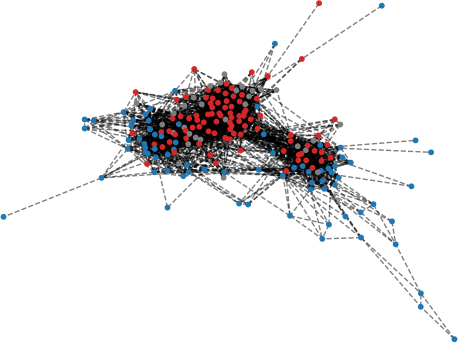

#SIR Model 

This folder contains the SIR model files for both NetLogo and Python model versions. 

1. NetLogo SIR model - NetLogo-based networked SIR model used to demonstrate the mechanics of disease spread across a social network. Replaced by the Python Mesa model for performance and compatibility reasons. Files:
   
2. Mesa SIR model - Python-based networked SIR model used to demonstrate the mechanics of disease spread across a social network. Contains both interactive and batch version of the model.
